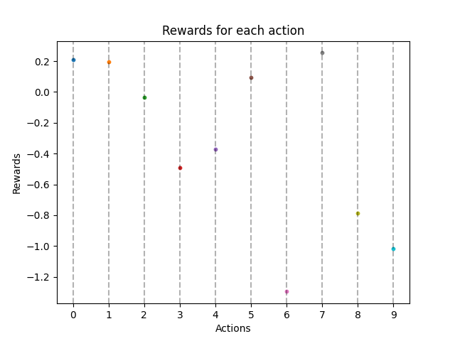
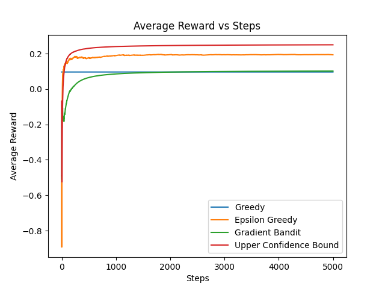
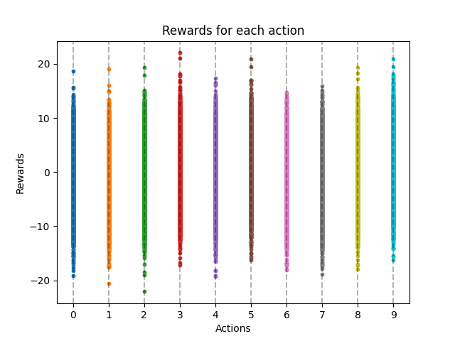
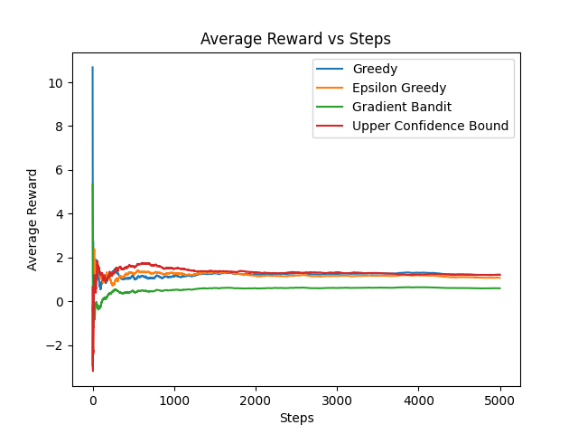

# Multi-Arm Bandits

This repository contains a collection of multi-arm bandit action selection algorithms implemented in Python.

This algorithms are based on the Chapter-2 of the book [Reinfocement Learning: An Introduction](http://incompleteideas.net/book/the-book-2nd.html) by Richard S. Sutton and Andrew G. Barto.

<table>
  <tr>
    <td style="text-align: center;">
      
      <br/>
      <span>Rewards for 10-armed testbed, constant rewards model</span>
    </td>
    <td style="text-align: center;">
      
      <br/>
      <span>Average rewards for different algorithms, constant rewards model</span>
    </td>
  </tr>
  <tr>
    <td style="text-align: center;">
      
      <br/>
      <span>Rewards for 10-armed testbed, non-constant rewards model</span>
    </td>
    <td style="text-align: center;">
      
      <br/>
      <span>Average rewards for different algorithms, non-constant rewards model</span>
    </td>
  </tr>
</table>

## Installation

```bash
conda create -f environment.yaml
```

## Algorithms

### Greedy

Greedy algorithm is the simplest algorithm for multi-arm bandit problem. It always selects the action with the highest estimated value.

The action selection step of greedy algorithm looks like this

```python
def select_action(self):
    selected_action_idx = np.argmax(self.Q)
    logger.debug(f"Selected action {selected_action_idx}")
    self.N[selected_action_idx] += 1
    return selected_action_idx
```

### Epsilon-Greedy

Epsilon-Greedy algorithm is a variant of greedy algorithm. It selects a random action with probability epsilon and selects the action with the highest estimated value with probability 1-epsilon.
Greedy algorithm always exploits and never explores. Epsilon-Greedy algorithm explores with probability epsilon and exploits with probability 1-epsilon.

The action selection step of epsilon-greedy algorithm looks like this

```python
def select_action(self):
    if np.random.random() < self.epsilon:
        selected_action_idx = np.random.randint(self.num_arms)
    else:
        selected_action_idx = np.argmax(self.Q)
    logger.debug(f"Selected action {selected_action_idx}")
    self.N[selected_action_idx] += 1
    return selected_action_idx
```

### Upper Confidence Bound

Epsilon-greedy action selection forces the non-greedy actions to be tried, but indiscriminately, with no preference for those that are nearly
greedy or particularly uncertain.

Upper Confidence Bound (UCB) solves this issue by introducing a numeric measure of uncertainty into the action selection process. The UCB algorithm
selects the action with the highest estimated value plus a bonus that decreases as the number of times the action has been selected increases.

The action selection step of UCB algorithm looks like this

```python
def select_action(self):
    ucb = self.Q + self.c * np.sqrt(np.log(self.t + 1) / (self.N + 1e-6))
    selected_action_idx = np.argmax(ucb)
    logger.debug(f"Selected action {selected_action_idx}")
    self.N[selected_action_idx] += 1
    self.t += 1
    return selected_action_idx
```

### Gradient Bandit

Gradient Bandit algorithm learns a numerical preference for each action. It uses these preferences to calculate the probability of selecting each action. The probability of selecting an action is proportional to the preference of that action.

The action preference is updated according to the expected reward of the action.
The preference update step of gradient bandit is based on the gradient ascent algorithm.

```bash
For the selected action a:
    H[a] = H[a] + alpha * (reward - baseline) * (1 - prob_a)

For all other actions b != a:

    H[b] = H[b] - alpha * (reward - baseline) * prob_b

H: represents the preference for each action.
alpha: is the learning rate, which determines the step size in updating the preferences.
reward: is the received reward for taking action a.
baseline: is the baseline value that helps to center the updates around the current average reward.
prob_a: is the probability of selecting action a using the softmax function.
prob_b: is the probability of selecting action b using the softmax function.
```

The action selection step of gradient bandit algorithm looks like this

```python
def select_action(self):
    softmax = np.exp(self.H) / np.sum(np.exp(self.H))
    selected_action_idx, self.selection_prob = self._sample_action(softmax)
    logger.debug(f"Selected action {selected_action_idx}")
    self.N[selected_action_idx] += 1
    return selected_action_idx

def _sample_action(self, softmax: np.ndarray):
    selected_action_idx = np.random.choice(np.arange(len(softmax)), p=softmax)
    selection_prob = softmax[selected_action_idx]
    return selected_action_idx, selection_prob
```
